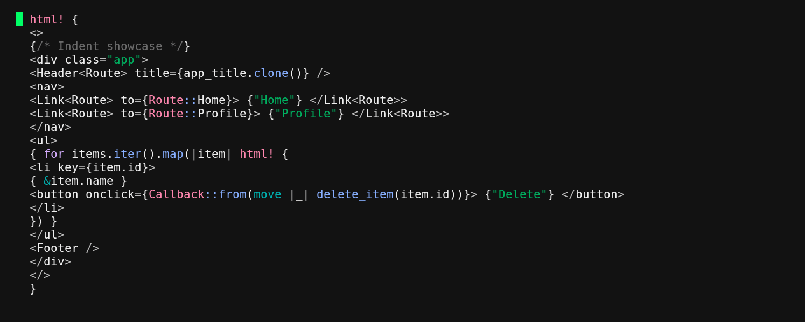

# Vim plugin for Yew macro formatting

This vim plugin is designed to **prettify Yew code blocks** in Rust files. It helps format and clean up the embedded Yew HTML-like syntax, making your Rust code more readable and consistent.



## Features

- **Prettify Selected Blocks**: Highlight a Yew HTML block in visual mode and format it.
- **Prettify Next Block**: Jump to and prettify the next Yew HTML block in your file.
- **Inline or Multi-Line Formatting**: Automatically determine whether to inline or break lines based on user configuration or file word wrap settings. [See demo](doc/demo-word-wrap.gif)

## Installation

```lua
-- Packer.nvim
use {
    "emilien-jegou/vim-yew-prettifier",
    config = function()
        require("yew_prettifier").setup({})
    end
}

-- Lazy.nvim
{
    "emilien-jegou/vim-yew-prettifier",
    config = function()
        require("yew_prettifier").setup({})
    end
}
```

## Configuration

The plugin comes with a default configuration. You can override these options in your setup function:

```lua
require("yew_prettifier").setup({
    tab_size = 4,              -- Indentation size for prettification
    max_line_width = nil,      -- Maximum line width for inlined blocks
                               --   nil: Use file's word wrap
                               --   0: Never inline
    custom_keymaps = {
        visual_mode = "go",    -- Keybinding for visual mode prettification
        normal_mode = "go",    -- Keybinding for lookahead prettification
    },
    enable_prettify_selection = true, -- Enable visual mode prettification and :YewPrettifySelection command
    enable_prettify_lookahead = true, -- Enable normal mode lookahead prettification and :YewPrettifyNext command
})
```

## Commands

The plugin provides the following commands:

```vim
:YewPrettifySelection -- Prettify the currently selected Yew HTML block in visual mode.
                         (visual mode keybind: go)

:YewPrettifyNext -- Prettify the next Yew HTML block in normal mode. 
                         (normal mode keybind: go)
```

## Limitations

Depending on the project popularity I may revisit how the AST parser get built
so that some of thoses pitfall get fixed, but for the time being you may face
the limitation and bugs stated below.
- Does not support yew inline "if" blocks
- This plugin do not prettify nested code block, only html tags will get prettified
- Will delete comments starting with '//' in blocks, use '/**/' instead
- Multiline strings containing brackets characters may create indentation issues, such as the following:
```rust
html! {
  <div>{r#"This breaks
        }"#}
      </div>
}
```

For a more integrated solution you may want to checkout [yew-fmt](https://github.com/its-the-shrimp/yew-fmt)

## Contributing

Contributions are welcome! Feel free to submit issues or pull requests on GitHub.

## License 

This plugin is open-source and available under the MIT License.
